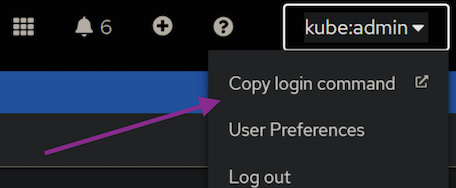

# Deploy IBM Sterling Control Center on OpenShift using Ansible Scripts

Playbook will run the last version of Sterling Control Center, but take care of Kubernetes/Openshift version is supported

| Sterling Control Center   | OpenShift           | Kubernetes          | helm-chart |
|---------------------------|---------------------|---------------------|------------|
| 6.4.2.0_2025-11-18        | >= 4.18             | >=1.30.0            | 4.2.0      |
| 6.4.1.0_2025-07-07        | >= 4.16             | >=1.30.0            | 4.1.0      |
| 6.4.0.0.iFix01_2025-05-19 | >= 4.14             | >=1.27.0            | 4.0.9      |
| 6.4.0.0.iFix01_2025-05-07 | >= 4.14             | >=1.27.0            | 4.0.6      |
| 6.4.0.0.iFix01_2025-04-04 | >= 4.14             | >=1.27.0            | 4.0.6      |
| 6.4.0.0_2024-12-17        | >= 4.14             | >=1.27.0            | 4.0.2      |
| 6.3.1.0.iFix04_2025-05-01 | >= 4.14             | >=1.27.0            | 3.1.15     |
| 6.3.1.0.iFix03_2024-11-04 | >= 4.14             | >=1.27.0            | 3.1.9      |


## Preparation

### 1. IBM Entitled Registry

You must have **kubectl**, **oc**, **git** and **ansible** installed in your machine

Log in the [IBM Container software library](https://myibm.ibm.com/products-services/containerlibrary) with the IBMid and password that are associated with the entitled software. Click **Get entitlement key**. With key export variable

```bash 
export ENTITLED_REGISTRY_KEY=<entitlement_key>
```

### 2. Login on OpenShift

Access the OpenShift console and click on your user icon in the upper-right corner to retrieve your login command.



Click on **Display Token**, and copy the oc login command and paste it into your terminal. Sample:

```bash 
oc login --token=sha256~P...k --server=https://c....containers.cloud.xxx.com:31234
```

### 3. Cloning ansible-ibm-sterling from git

```bash 
git clone https://github.com/ibm-sterling-devops/ansible-ibm-sterling.git
```

### 4. Set roles path

To run playbook the playbook

```bash 
cd ansible-ibm-sterling

export ANSIBLE_CONFIG=./ansible.cfg 
```

## Deploying Sterling Control Center

1) First you need to provide SCC_INSTANCEID, this is used to define your environment. Samples: dev01, dev02, poc01, qa01, prod01

```bash 
export SCC_INSTANCEID=dev01
```


2) You must define which product to install

```bash 
export SCC_PRODUCTS=CCM,CCD
```

where SCC_PRODUCTS is the product that you want to install

| Product | Description      |
|---------|------------------------------|
| CCD     | Sterling Control Center Director |
| CCM     | Sterling Control Center Monitor  |


3) To run the playbook

```bash 
ansible-playbook playbooks/deploy_scc.yml
```

## Environment Variable

Environment variables for this role:

| Environment Variable        | Default Value         | Required | Description                                      |
|-----------------------------|-----------------------|----------|--------------------------------------------------|
| ENTITLED_REGISTRY_KEY       | N/A                   | Yes      | Entitlement registry key                         |
| SCC_INSTANCEID              | N/A                   | Yes      | Instance ID for SCC application                  |
| SCC_PRODUCTS                | ''                    | Yes      | Products for SCC application (CCM,CCD; CCM; CCD) |
| DB2_NAMESPACE               | N/A                   | No       | Namespace for DB2                                |
| SCC_LICENSETYPE             | non-prod              | No       | License type for SCC application (prod or non-prod) |
| SCC_SYSTEM_PASSPHRASE       | passw0rd              | No       | System passphrase for SCC application            |
| SCC_ADMIN                   | admin                 | No       | Admin username for SCC application               |
| SCC_ADMIN_PASSWORD          | passw0rd              | No       | Admin password for SCC application               |
| SCC_TRUSTSTORE_PASSWORD     | changeit              | No       | Truststore password for SCC application          |
| SCC_KEYSTORE_PASSWORD       | changeit              | No       | Keystore password for SCC application            |
| SCC_EMAIL_PASSWORD          | passw0rd              | No       | Email password for SCC application               |
| SCC_DBVENDOR                | N/A                   | No       | Database vendor for SCC application              |
| SCC_DBHOST                  | N/A                   | No       | Database host for SCC application                |
| SCC_DBPORT                  | N/A                   | No       | Database port for SCC application                |
| SCC_DBNAME                  | N/A                   | No       | Database name for SCC application                |
| SCC_DBUSER                  | N/A                   | No       | Database user for SCC application                |
| SCC_DBPASSWORD              | N/A                   | No       | Database password for SCC application            |
| SCC_SMTPHOST                | smtp.company.com      | No       | SMTP host for SCC application                    |
| SCC_SMTPPORT                | 25                    | No       | SMTP port for SCC application                    |
| SCC_EMAIL_RESPOND           | noreply@company.com   | No       | Email respond address for SCC application        |
| SCC_ADMIN_MAILADDR          | admin@company.com     | No       | Admin email address for SCC application          |
| SCC_SMTP_TLSENABLED         | false                 | No       | SMTP TLS enabled for SCC application             |
| SCC_JMS_USERNAME            | N/A                   | No       | JMS username for SCC application                 |
| SCC_JMS_PASSWORD            | N/A                   | No       | JMS password for SCC application                 |
| SCC_JMS_KEYSTORE_PASSWORD   | N/A                   | No       | JMS keystore password for SCC application        |
| SCC_JMS_TRUSTSTORE_PASSWORD | N/A                   | No       | JMS truststore password for SCC application      |
| SCC_TIMEZONE                | America/New_York      | No       | Timezone for SCC application                     |


For all environment variables

* Role [scc_deploy](../../roles/scc_deploy)
* Role [scc_setup_db2](../../roles/scc_setup_db2)
* Role [scc_deploy_db2](../../roles/scc_deploy_db2)
* Role [scc_deploy_mq](../../roles/cc_deploy_mq)